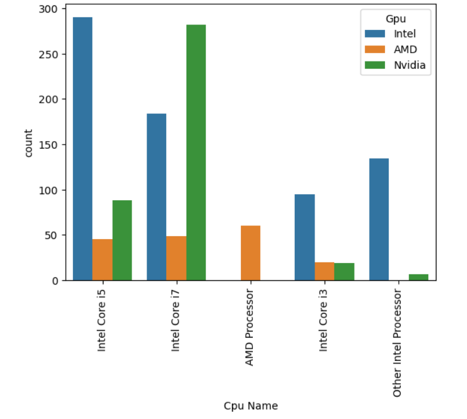
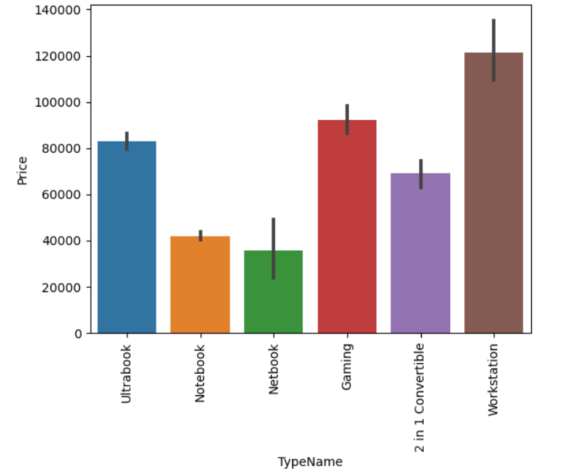
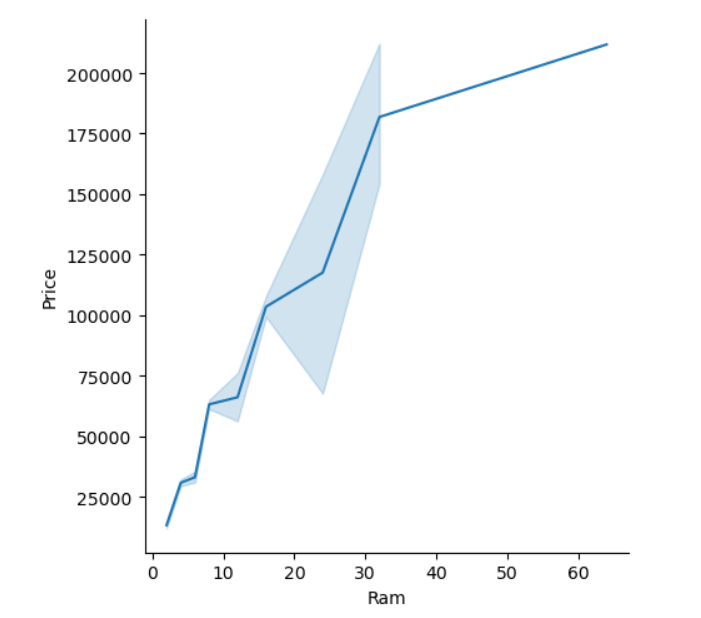
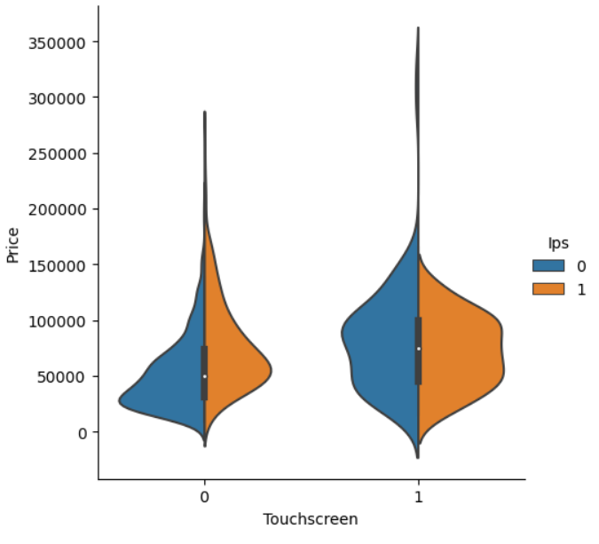
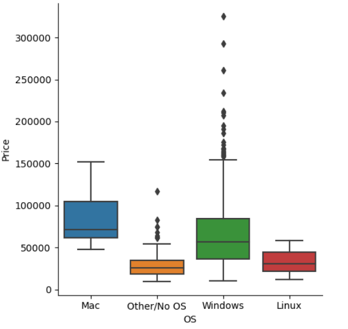

# Laptop-Price-Prediction

- Designed a web app that predicts the price of the laptop given the configurations.
- Developed Linear, CatBoost, Random Forest Regressors, many more to get the best model.
- Runned the Machine Learning model using flask

# Feature Engineering  
We go through all the features one by one and keep adding new features. I have made the following changes and created new variables: 

- RAM - Made columns for Ram Capacity in GB.
- Processor - Made columns for Name and Type of the Processor
- Operating System - Parsed the Operating System from this column and made a new column
- Storage - Made new columns for the type of Disk Drive and the capacity of the Disk Drive Making HDD, SSD and Flash Drive Storage Columns
- Display - Made new columns for Touchscreen and IPS Display.
- PPI (Pixels per Inches) - By Dividing the Product of Resolutions by the Display Size of the Laptop(in Inches).
- Description - Made new columns for the company and Graphic card

# Data PreProcessing
There are few columns which are categorical here but they actually contain numerical values.So we need to convert few categorical columns to numerical columns. 
These are Weight, Inches, Storage_GB, Price.

# Exploratory Data Analysis

# Model Building
Used scikit-learn library for the Machine Learning tasks. Applied label encoding and converted the categorical variables into numerical ones.Then splited the data into training and test sets with a test size of 20%. Tried different models ( Linear Regression, Random Forest Regression, XGBoost, CatBoost, etc) and evaluated them using Mean Absolute Error and R Square.

# Source of the dataset
[Laptop price dataset](https://www.kaggle.com/datasets/imsakshimittal/laptop-price-dataset)
